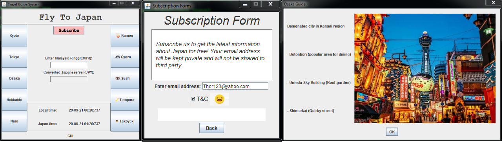
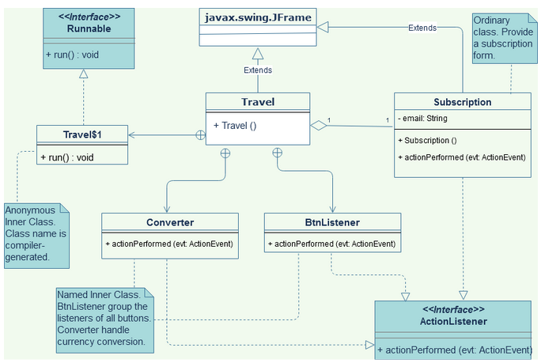
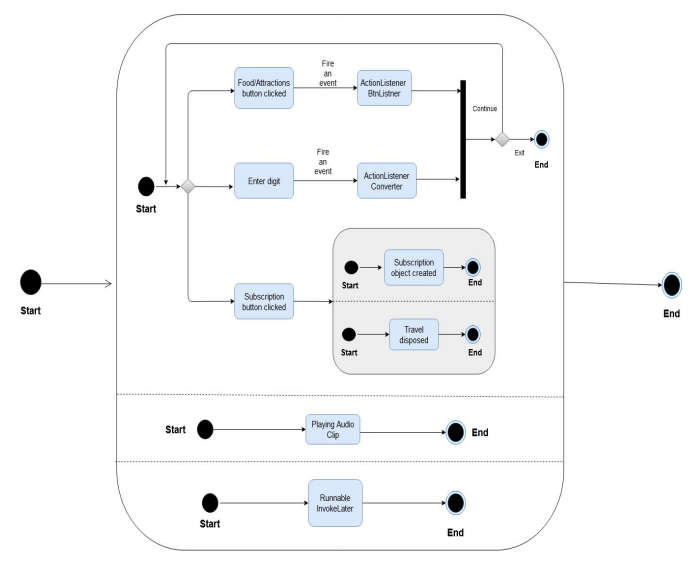
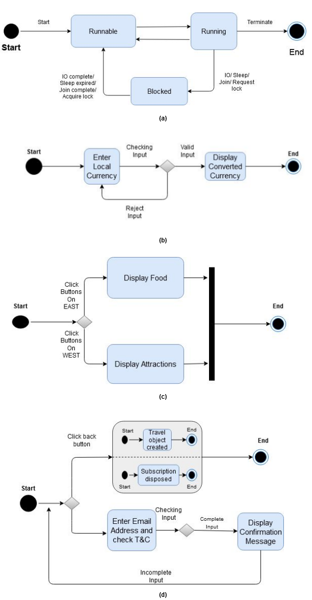

# Japan Travel Guide System
A simple Java program created after reading some notes about GUI Programming......  
PS: A special gratitude to someone sharing useful notes [yet another insignificant Programming Notes](https://personal.ntu.edu.sg/ehchua/programming/index.html)

 
 

# Intro
* A web-based travel guide system 
* Cross-platform & multi-thread
* Swing & AWT
* JFrame/Frame
* Exception handling
* File handling
* Content
  * Food guide
  * Attraction guide
  * Time zone 
  * Currency conversion (MYR to JPY) 
  * Free subscription

 
 

# How to run
1. Clone the repo
2. `cd <project directory>`
3. To compile the code, run `javac Travel.java`
4. The program is compiled beforehand, run `java Travel` straight away

 
 

# Sample Output
Main page, attraction guide, subscription page   

 
 

# Diagrams
Use case diagram    

 

Class diagram   

 

State diagram for class Travel   

 

State diagram for (a) Travel$1 (b) Converter (c) BtnListener (d) Subscription   

